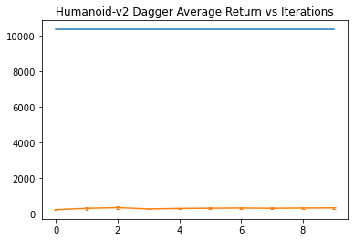

## Question 1.2

## Question 1.3

I tweaked the size of each layer and plotted the average returns in the Humanoid-v2 environment. I changed the layer size because the Humanoid-v2 was a more complex model and having larger layer sizes would let the model encode more complex features.

## Question 2.2

For Dagger, I tried the Ant environment and the Humanoid environment.

Because the trained agent performed so poorly compared to the expert, I also plotted the average returns without the expert. The plot shows a slow but upward learning curve.

For the Ant environment, the trained agent matched the expert after a couple iterations so it just bounced around at that range in the later iterations.

