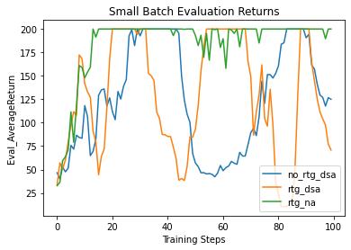
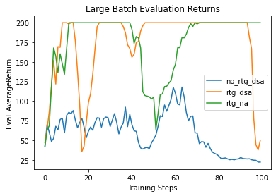
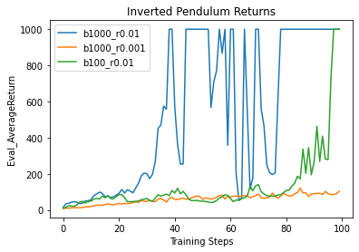
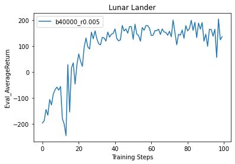
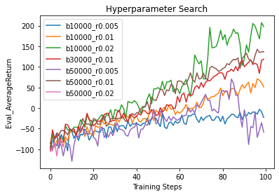
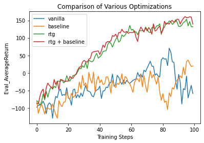

# Policy Gradients

## Q1

The one using reward-to-go had better performance without standardization, but standardization helped performance further. Having a larger step size seems to decrease the number of iterations to converge, but may cause the algorithm to not converge.

I used the configurations provided in the PDF and ran in colab.

## Q2

b=1000 and r=0.01 seemed to more consistently converge, but sometimes b=100 would work.
I used the arguments in the pdf and changed the batch size and learning rate to perform searches.

## Q3

## Q4

I tried out a subset of the range provided in the PDF: b in [10000, 30000, 50000], and r in [0.005, 0.01, 0.02]. Higher learning rates and higher batch sizes seemed to help the algorithm do better, so I used b=50000 and r=0.02 for the subsequent experiments.

The vanilla algorithm did the worst as expected, and the rtg+baseline algorithm did the best. It was surprising that rtg had a bigger effect than using a baseline.
