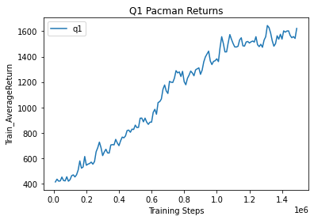
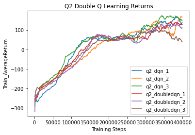
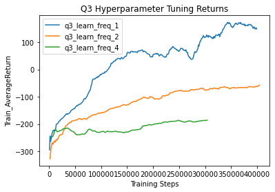
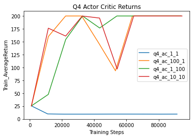
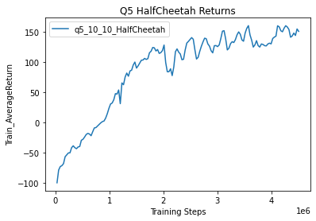
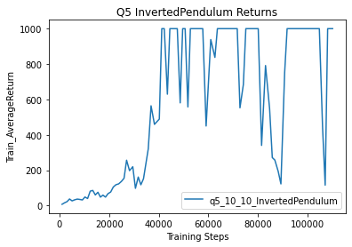

# Q-Learning and Actor-Critic Algorithms

## Q1

## Q2

## Q3

I tested out different learning frequencies for the lunar lander task. I thought having a lower frequency (higher value) would make the model more stable, but the plot shows that it actually makes the model learn slower. It kind of makes sense because the model is getting less updates over the course of training.

## Q4

I tried out all the supplied hyperparameters. The most stable seemed to be -ntu 10 -ngsptu 10

## Q5

I ran the model using the supplied parameters and the hyperparameters found in Q4:

