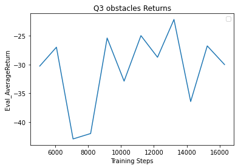
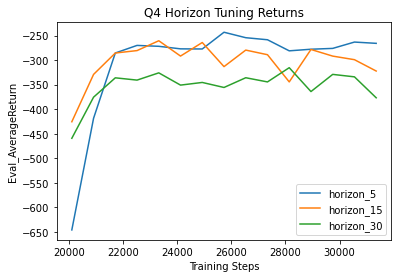

# Model Based Reinforcement Learning

## Q1

The three plots shown above are from n500_arch1x32, n5_arch2x250, and n500_arch2x250 respectively. The first plot shows the the prediction was ok, staying close to the actual trajectory although deviating a little. The MPE was pretty low. The second plot performed much worse, barely fitting the trajectory. The third plot had a much lower MPE and was able to fit the trajectory almost exactly. This shows that having a larger model can help fit the dymanics model better, but training time is also a large factor. If a model is not allowed to converge, increasing the size won't do much.

## Q2

## Q3

## Q4

In the above plot we show the performance of agents with different ensemble sizes. It's quite visible that the agents with higher ensemble sizes converge faster, and tend to reach higher returns. This makes sense as the agent is expected to fit the dynamics model better with a larger ensemble size.

The horizon experiment results seems counterintuitive, as one might think that planning further ahead would allow the agent to perform better. However, the model with the shortest horizon performed the best out of the three, and the one with the longest horizon performed the worst. This might be because the model isn't able to predict the future state accurately with longer horizons, so the estimated returns are bad estimates.

It makes sense that when the number of candidate action sequences increase, the model performs better, since having more candidate sequences allows the model to have a better sample of the action space.
